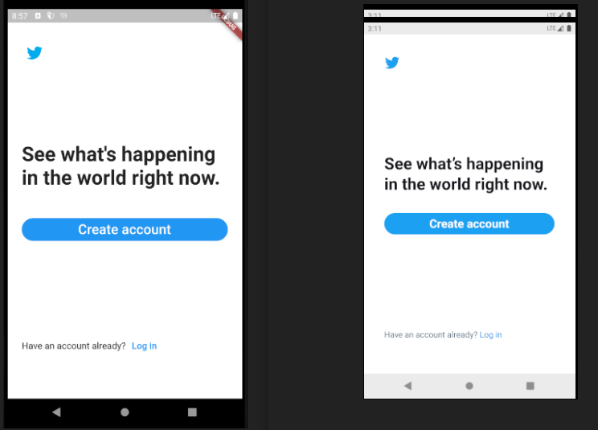
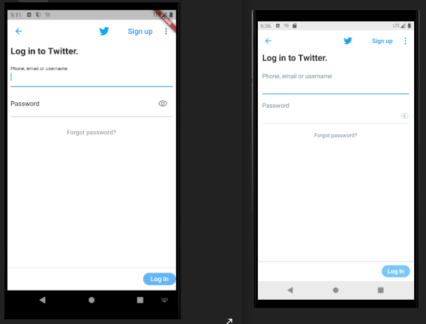
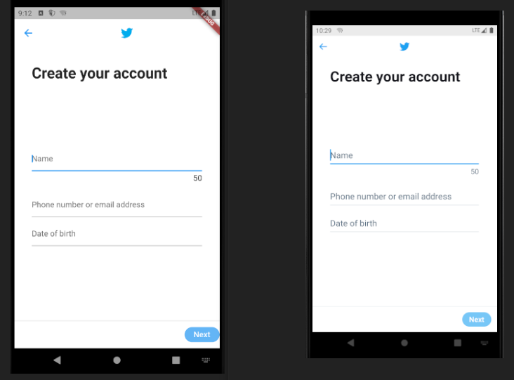
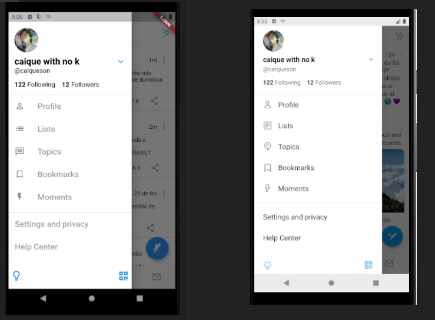

# clone_twitter

An application made in Flutter to copy the appearance of the Twitter application.

Watch the gif demonstrating the application:

See the comparisons between the real application (right) and the clone (left):

You can download the application and install it on your phone (Android) at: build\app\outputs\flutter-apk\app-release.apk

Or see the images based to build the app in the folder: images\original
